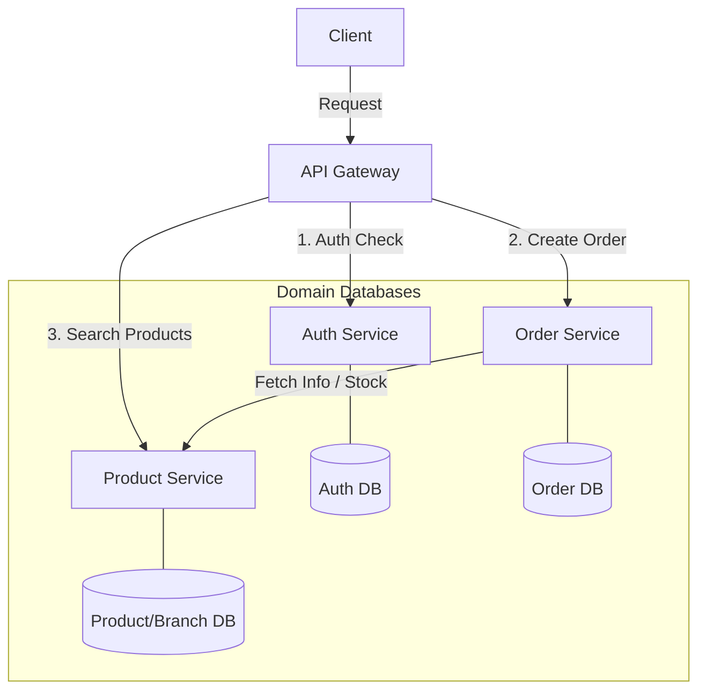
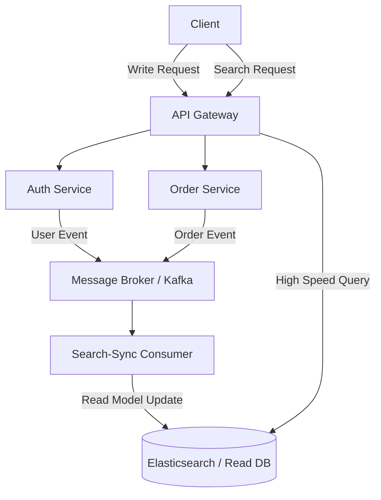

# Global Auth & Gateway System (Spec-First MSA)

본 프로젝트는 대규모(20인 이상) 개발 팀이 협업하여 구축하는 **중앙 집중형 인증(Auth) 및 고성능 라우팅(Gateway)** 솔루션의 참조 아키텍처입니다.

## 🚀 Project Philosophy: Spec-First
이 프로젝트는 코드를 짜기 전 명세를 먼저 확정하는 **SSOT(Single Source of Truth)** 원칙을 따릅니다.
- 모든 설계 근거는 [specs/](./specs/) 폴더에 마크다운으로 기록됩니다.
- 주요 기술적 결정은 [ADR(Architecture Decision Records)](./specs/decisions/)을 통해 관리됩니다.
- 20인 이상의 개발자가 커뮤니케이션 비용 없이 협업할 수 있는 **Modular Monorepo** 구조를 지향합니다.

## 🏗 System Architecture Roadmap

본 프로젝트는 서비스의 성장 단계에 따른 단계별 아키텍처 진화 로드맵을 지향합니다.

### 📍 Phase 1: Current Architecture (As-Is)
현재 시스템은 **API Gateway를 통한 API Composition** 방식을 채택하고 있으며, 상품과 지점(Branch) 정보를 관리하는 **Product Service**가 추가되었습니다.


- **Product Service (8083)**: 상품 기본 정보, **지점(Branch)** 정보 및 지점별 재고(Stock)를 통합 관리.
- **Service-to-Service (S2S)**: `Order` 서비스가 주문 시 `Product` 서비스에 재고를 물어보는 실전 MSA 통신 패턴 적용.

### 📍 Phase 2: Future Roadmap (To-Be)
트래픽 및 검색 요구사항이 복잡해지는 시점에는 **Event-Driven CQRS** 패턴으로 전환하여 조회 성능을 극대화할 예정입니다. ([ADR 008](./specs/decisions/008-cqrs-roadmap.md) 참조)


- **전환 시점**: 통합 조회 API의 응답 속도가 임계치를 넘거나, 복잡한 다차원 검색이 필요할 때.
- **핵심 전략**: 쓰기 작업은 RDB에서, 읽기 작업은 비정규화된 문서DB(ES)에서 처리하여 성능 최적화.

## 🛠 Tech Stack
- **Framework**: Java 17, Spring Boot 3.2.4
- **Security**: Spring Security, JWT (JJWT 0.12.5)
- **Infrastructure**: Spring Cloud Gateway, Resilience4j, Redis, MySQL/H2
- **Build Tool**: Gradle Multi-project (Monorepo)
- **Deployment**: Docker, Kubernetes (ConfigMap & Secret 기반 설정 분리)

## 📁 Project Structure
```text
root/
├── specs/                  # [SSOT] 모든 설계 및 기술 결정 문서
├── common-lib/             # 모든 서비스가 공유하는 표준 모듈
├── auth-service/           # 인증 서버 (Security, JWT, JPA)
├── gateway-service/        # 게이트웨이 (Routing, Global Auth Filter)
├── order-service/          # 주문 서비스 (Business Logic)
├── build.gradle            # 전사 표준 기술 스택 정의
└── settings.gradle         # 모듈 통합 관리 설정
```

## ⚙️ Getting Started & Verification

본 프로젝트는 IntelliJ IDEA와 Postman을 활용하여 가장 쉽게 테스트해 볼 수 있습니다.

### 1. IDE에서 실행하기 (IntelliJ 권장)
1. **프로젝트 열기**: `File > Open` 메뉴에서 본 프로젝트 폴더를 선택합니다.
2. **Gradle 로드**: 우측 하단의 Gradle 빌드가 완료될 때까지 기다립니다.
3. **서비스 실행 (순서 필수)**:
   - **Step 1**: `auth-service` 모듈의 `AuthApplication.java` 실행 (8081 포트)
   - **Step 2**: `order-service` 모듈의 `OrderApplication.java` 실행 (8082 포트)
   - **Step 3**: `gateway-service` 모듈의 `GatewayApplication.java` 실행 (8080 포트)
   - *주의: 내부적으로 H2 인메모리 DB를 사용하므로 별도의 DB 설치 없이 즉시 실행 가능합니다.*

### 2. Postman으로 기능 검증하기
모든 요청은 개별 서비스가 아닌 **게이트웨이(8080)**를 통해 전달되어야 합니다.

#### ✅ 시나리오 1: 회원가입 (Signup)
- **Method**: `POST`
- **URL**: `http://localhost:8080/api/v1/auth/signup`
- **Body (JSON)**: `{"username": "tester", "password": "password123", "email": "tester@example.com"}`

#### ✅ 시나리오 2: 로그인 및 토큰 발급 (Login)
- **Method**: `POST`
- **URL**: `http://localhost:8080/api/v1/auth/login`
- **Body (JSON)**: `{"username": "tester", "password": "password123"}`
- **기대 결과**: 응답 바디에 `accessToken`이 포함되어 반환됩니다.

#### ✅ 시나리오 3: 주문 생성 및 조회 (Order)
1. **주문 생성**: `POST http://localhost:8080/api/v1/orders`
   - **Header**: `Authorization: Bearer {accessToken}`
   - **Body**: `{"productId": "laptop-001", "quantity": 1}`
2. **내 주문 조회**: `GET http://localhost:8080/api/v1/orders`
   - **Header**: `Authorization: Bearer {accessToken}`
   - **기대 결과**: 내가 방금 주문한 내역만 리스트로 반환됩니다.

## 🛡 Engineering Standard
본 프로젝트는 엄격한 엔지니어링 표준을 준수합니다. 상세 내용은 [specs/engineering.md](./specs/engineering.md)을 참조하세요.
- **Commit Convention**: `feat(scope): spec-id - description`
- **Definition of Done (DOD)**: 빌드/테스트 성공 및 명세 일치 확인 필수.

---
[AI Context: Normal | Snap: OK]
