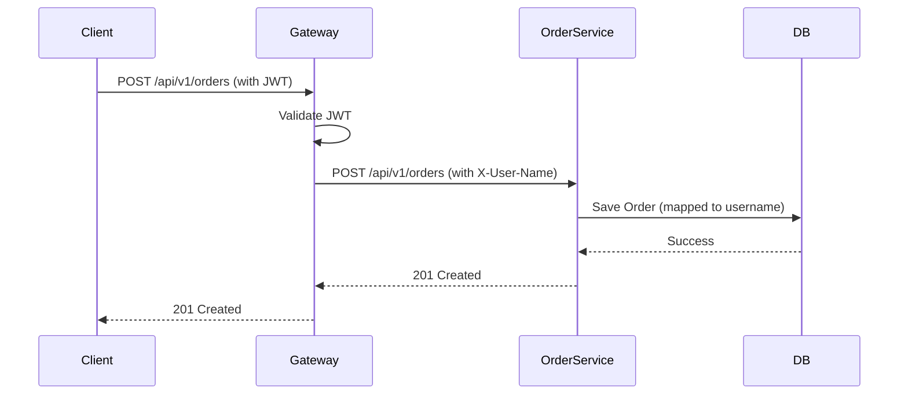

# Blueprint: Order Service

## 1. Overview
사용자의 주문을 처리하고 조회하는 마이크로서비스. 모든 요청은 Gateway의 인증을 거쳐야 함.

## 2. API Specifications

### 2.1 Create Order
- **Endpoint**: `POST /api/v1/orders`
- **Request Headers**: `X-User-Name` (from Gateway)
- **Request Body**:
  ```json
  {
    "productId": "string",
    "quantity": "number"
  }
  ```
- **Response**: `ApiResponse<OrderResponse>`

### 2.2 My Orders
- **Endpoint**: `GET /api/v1/orders`
- **Request Headers**: `X-User-Name` (from Gateway)
- **Response**: `ApiResponse<List<OrderResponse>>`

## 3. Sequence Diagram

